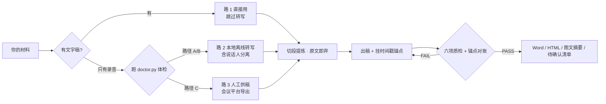

# meeting-minutes · 会议纪要技能

把一场会议的**录音 / 转写稿 / 文字记录**，变成可以直接发出去、而且每条结论都能被机器验证的会议纪要。

> 会议纪要不该靠猜。每条决策、每个行动项都能点回原话出处，找不到依据就老实写「待确认」。


---

## 目录

- [v3 更新了什么](#v3-更新了什么)
- [三步装上](#三步装上)
- [开工确认单：先问，再动](#开工确认单先问再动)
- [转写这件事：三条路](#转写这件事三条路)
- [六个阶段](#六个阶段)
- [说话人分离：责任人不再是「待确认」](#说话人分离责任人不再是待确认)
- [出处可验证：锚点对账](#出处可验证锚点对账)
- [常见问题](#常见问题)

---

## v3 更新了什么

v3 = **v2（准确度）** + **v1（兜底能力）**。两版各有所长，也各有一个致命短板，合并后互相补上。

### v2 解决了「转得准」，但假设录音一定能转

| v2 带来的能力 | 解决什么问题 |
|---|---|
| **说话人分离**（sherpa-onnx，本地 CPU） | 谁在说话分得清，责任人不再是清一色「待确认」 |
| **出处锚点机器校验** `verify_refs.py` | 把每条结论的时间戳拿去和转写稿 JSON 对账，**编造的时间戳会被机器抓出来** |
| **术语表纠错** | 专有名词总被听错（PVT→PPT、SKU→Skill），一次配置永久生效 |
| **独立虚拟环境 + 可彻底卸载** | 不污染系统 Python；删掉一个文件夹就恢复原样 |
| **三层目录**（原文 / 纪要 / 过程） | 原文只读、纪要派生，改纪要不会污染原文 |
| **HTML 交付物** | 双击可看，带目录，`[时:分:秒]` 可点回原文 |
| **开工确认单** | 先问再动，杜绝 AI 自作主张先跑一轮 |
| **采访访谈模板** | 第五套章节骨架 |

### v1 解决了「转不了也走得下去」—— v2 缺的正是这个

v2 的整个流程建立在「录音能转写」这个前提上。**一旦装不上、下不动，流程就死了**，AI 只能换着花样重试，一轮十分钟。

| v1 补回的能力 | 解决什么问题 |
|---|---|
| **转写三条路**（甲/乙/丙分档） | 有文字稿就直接跳过转写；转不了就转人工供稿 |
| **doctor 路线结论 A / B / C** | 10 秒体检直接给结论，用结论取代试错；退出码 3 = 立刻转路 3 |
| **人工补录模板** `make_manual_template.py` | 实在拿不到稿子时，生成模板边听边填，不是死路 |
| **三条死规矩** | 转写最多试一次；禁止蹭在线转写网站；不许说「我再试试别的办法」 |

### 融合后的取舍

- **主干用 v2** —— 工程化程度更高（配置化、模块化、独立环境、可卸载）。
- **判档逻辑注入 v2 的 `doctor.py`** —— 保留 v2 的八项体检，末尾追加路线结论。
- **保留 v1 的人工补录模板**，并把 v2 的三层目录路径（`原文/`）写进文档。
- **PPT 改成按需生成** —— v1 默认出 Word + PPT，v2 实测发现多数场景只要 Word，默认不做能省一半时间。

---

## 三步装上

### 1. 放文件

把 `meeting-minutes` 文件夹复制到你的技能目录：

| 环境 | 路径 |
|---|---|
| WorkBuddy（Windows） | `C:\Users\<你的用户名>\.workbuddy\skills\` |
| WorkBuddy（macOS / Linux） | `~/.workbuddy/skills/` |
| Claude Code | `~/.claude/skills/` 或 `项目/.claude/skills/` |

```
meeting-minutes/             ← 技能本体，整个拷到技能目录即可
├── SKILL.md                 ← 主流程（先读第一条规则）
├── README.md                ← 这个目录是什么、人看的文档在哪
├── config.json              ← 配置（不含绝对路径，换电脑能用）
├── 术语表.txt                ← 听错词纠错表
├── references/              ← 五套章节模板 / 证据与质检规范 / 版式规范
└── scripts/                 ← 15 个脚本，速查表见 scripts/README.md

docs/                        ← 给人看的：说明书 / 安装说明 / 单文件版
```

技能本体里只有 AI 要读的文件；`docs/` 是给人看的，不用拷进技能目录。

### 2. 装环境（重资产，一次就行）

```powershell
python scripts/bootstrap.py --install --models small --with-diarization
```

依赖与模型装进**一个**文件夹（默认 `%USERPROFILE%\.meeting-minutes`，可 `--home D:\AIModels` 改到别的盘）。
不写注册表、不改 PATH、不碰系统 Python —— **想彻底删掉就把那个文件夹整个删掉**。

装完随时可查：`python scripts/doctor.py`

### 3. 说一句话就能用

```
用 meeting-minutes 技能，把这段录音整理成会议纪要
```

---

## 开工确认单：先问，再动

收到材料的第一个动作是发这张单子，**然后等回答**。在用户回答之前禁止跑任何脚本
（不许试跑、不许探测时长、不许检查音质）。

```
1. 材料：录音文件 / 已有文字稿
2. 会议类型：内部工作会 / 决策评审会 / 跨部门对接会 / 外部沟通会 / 采访访谈
3. 参会人：姓名 + 角色 + 是否发言
4. 说话人数：几人（不知道就填「不知道」）
5. 交付形态：Word 纪要 / 图文摘要 / PPT（PPT 按需）
6. 无关段落：寒暄、吃饭、闲聊 → 保留并标记 / 直接剔除
7. 术语表：有没有经常被听错的词
```

第 1 项的答案决定 Phase 1 走哪条路。

---

## 转写这件事：三条路

**转写不是必经步骤，只是拿稿方式之一。**



| 档位 | 材料 | 走哪条路 |
|---|---|---|
| **甲** | 已有文字稿 | **路 1** —— 规范成 `[时:分:秒] 发言人N：…`，跳过转写 |
| **乙** | 录音，体检判定可转 | **路 2** —— 本地离线转写 |
| **丙** | 录音，体检判定本机不行 | **路 3** —— 转人工供稿，立即停止尝试 |

### 路 3 的三条拿稿通道

判定 C 之后**不要重试**，按推荐顺序任选一条：

1. **会议平台自带纪要** —— 腾讯会议 / 飞书妙记 / 钉钉闪记，录完导出即可，比本地转写更准
2. **手机录音机自带转写** —— iPhone 备忘录、小米 / 华为 / OPPO 录音机多有「转文字」
3. **剪映 / 讯飞听见 / 网易见外** —— 导入音频导出字幕，多数有免费额度

实在拿不到，生成模板边听边填：

```powershell
python scripts/make_manual_template.py "<音频>" --out "<工作目录>/原文/转写稿.md"
```

### 三条死规矩

| # | 规矩 | 为什么 |
|---|---|---|
| T1 | 转写最多试一次：一次体检 + 一次安装，失败立刻转路 3 | 换花样重试每轮十分钟级，成功率极低 |
| T2 | 禁止用浏览器自动化蹭在线转写网站 | 要登录/验证码/付费，成功率接近零 |
| T3 | 不许说「我再试试别的办法」 | 说了就是没决策，要么给结论要么转路 3 |

---

## 六个阶段

| 阶段 | 干什么 | 你参与吗 |
|---|---|---|
| Phase 0 | 开工确认单 + 建三层目录 | **要你填** |
| Phase 1 | 先判档 → 三条路选一条 | 不用 |
| Phase 2 | 按议题切段、逐段提炼、原文即弃 | 不用 |
| Phase 3 | 去重、套模板、挂时间戳锚点、出稿 | 不用 |
| Phase 4 | 六项质检 + 锚点对账 | 不用 |
| Phase 5 | 出 Word / HTML / 图文摘要，PPT 按需 | 选交付形态 |

```
<会议名>_<日期>/
├── 原文/  转写稿.md（人看）、.json（机器校验用）、.html（带锚点）
├── 纪要/  会议纪要.md/.docx/.html、图文摘要、待确认清单、出处校验报告
└── 过程/  开工确认单、节点记录、要点稿、质检报告
```

---

## 说话人分离：责任人不再是「待确认」

用 `sherpa-onnx` + pyannote 分割模型 + 3D-Speaker 声纹模型，**纯 CPU、本地离线**。

```powershell
python scripts/diarize.py "<音频>" --speakers 3
```

实测数据（本机 CPU，i7 级）：

| 项目 | 数值 |
|---|---|
| 处理速度 | 60 秒音频约 30–60 秒 |
| 分割模型 | 5.7 MiB |
| 声纹模型（中文） | 37.8 MiB |
| 聚类效果 | 自动判断会分出 4 个；**指定人数后收敛到实际人数** |

三点必须说清楚：

- 编号是**声纹聚类结果，不等于真实身份**，跨会议不通用。
- **填人数能显著改善效果** —— 自动判断容易把同一人的不同语气分成多个。
- 远场、多人抢话的录音会有 10–20% 的句子判错边界。判不准的进待确认清单，**不硬猜**。

---

## 出处可验证：锚点对账

`verify_refs.py` 把纪要里每条结论的时间戳，逐个拿去和 `原文/转写稿.json` 的真实发言区间对账（容差 2 秒）：

```powershell
python scripts/verify_refs.py "<工作目录>"
```

输出示例：`锚点 29/29 有效；0 条要点有问题`

这是「可复核」从口号变成事实的关键一步 —— **编造时间戳会被机器抓出来**。
也正因如此，修复质检失败时只允许两个动作：标注「待确认」，或删除该条目。

---

## 常见问题

**Q：本机装不上 / 连不下模型怎么办？**
跑 `doctor.py` 看路线结论。判定 C 就转人工供稿（三条通道见上）。别死磕本地转写，会议平台自带纪要往往更快更准。

**Q：我已经有文字稿了？**
不用转写。材料选「已有文字稿」直接跳过整个环节。人工速记和平台导出通常比离线转写更准。

**Q：转写要联网吗？会上传录音吗？**
不联网、不上传，全程本地。只有**首次安装**需要下载依赖和模型。

**Q：为什么责任人还是「待确认」？**
两个可能：没装说话人分离模型（体检会提示），或说话人编号没能映射成真名 —— 需要你在确认单里给姓名表。

**Q：专有名词总被听错怎么办？**
编辑 `术语表.txt`，每行一条 `错的写法 = 正确写法`（如 `PVT = PPT`）。私密词条写进 `术语表.local.txt`，那个文件不随包发布。

**Q：质检 FAIL 了怎么办？**
只有两个合法动作：标注「待确认」，或删除该条目。**禁止编造时间戳** —— 那正是锚点校验要防的事。

**Q：想彻底卸载？**
删掉 `bootstrap.py` 建的那个文件夹（默认 `%USERPROFILE%\.meeting-minutes`）即可，电脑恢复原样。

---

## 文档

- [`说明书.md`](docs/说明书.md) —— 面向使用者的完整说明
- [`安装说明.md`](docs/安装说明.md) —— 安装步骤与「没有网络怎么办」
- [`单文件版-可直接粘贴给AI.md`](docs/单文件版-可直接粘贴给AI.md) —— 不想装技能？整份复制粘进对话即可

## License

MIT
